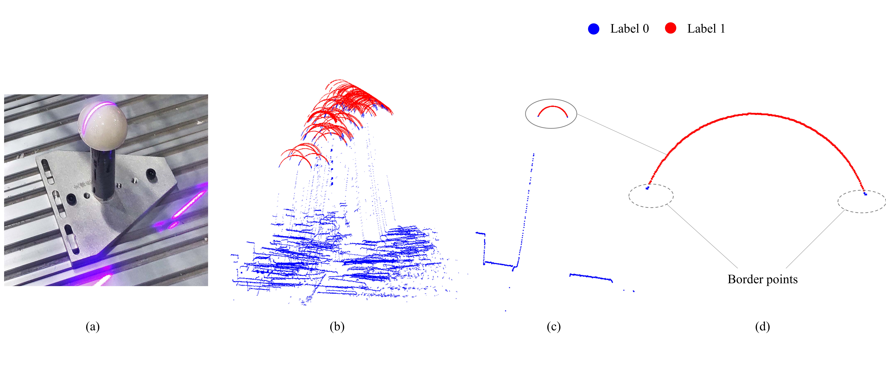

# Standard Sphere Seg Dataset V1

Standard sphere Seg is a dataset containing 2,255 profiles (or 2d point clouds) data collected by commercial laser profilometers (laser scanners) with point-wise labels spanning 2 classes: points within or out of  the standard sphere region. The dataset is used for laser profilometers integrated industrial robot or machine hand-eye calibration and other related tasks.

The following figures show the hand-eye calibration testbed and give the dataset visualization. Fig. a shows the scanned standard sphere, and Fig. b shows all the labelled profiles with labels of the test set. Fig. c shows one labeled sample. Label 0 stands for the points projected on out of the standard sphere while label 1 stands for the points within the standard sphere. Besides, when labelling profiles, border region points are tended to be labelled as 0, as these points always have low measurement quality empirically.



## Download the dataset

Downloading URL will be publiced after the manuscript accepted.


## Data organization

The dataset is split into training set (1,392 profile files), a validation set (348 profile files), and a test set (515 profile files). Some profiles are similar as they are collected in the same position with same collection parameters. The nominal point number of each laser line is 1280, but for most profiles, the number of the laser points is less than 1,280 as some laser points are missing.          

### Point-level labels

Table 1 shows the statistics of the point-level labels in all splits of the dataset. 

<p align='center'>Table 1: Statistics of the number of the point-level labels .</p>

| Label categories |     Train | Validation |    Test |
| ---------------: | --------: | ---------: | ------: |
|          Label 0 | 1,309,625 |    326,861 | 483,140 |
|          Label 1 |   472,135 |    118,579 | 176,060 |


### Dataset file structures

The dataset file structures are shown as following:

```bash
└── Standard sphere seg dataset v1	
	├── label_out_1
		├── xxx.csv
		└── ...
	├── label_out_2
	├── label_out_3
	├── label_out_4
	├── label_out_5
	├── label_out_6
	├── label_out_7
	├── label_out_8
	├── label_out_9
	├── label_out_10
	├── train_file.txt
	├── val_file.txt

	└── test_set
		├── label_out_T1
		├── label_out_T2
		└── val_file.txt
```

Where file folders label_out_1-label_out_10 contain all the training and validation csv files, and file folders label_out_T1, label_out_T2 contain all the test csv files.

### Data Formats

The data tarballs contain the following files:

#### xxx.csv

There's one such file for each subset inside train, validation, and test subdirectories respectively. One file is a sample, and each file contains point coordinates and labels as:

```bash
#x,    z,      label
69.280,114.785,0.000
69.050,115.510,0.000
68.960,115.340,0.000
68.895,115.000,0.000
68.850,114.525,0.000
68.760,114.345,0.000
...
```

For the file name starting with 'm_', like `m_11_5.csv`,it means the corresponding Y-coordinate of the  sphere center is minus. If the file name starts with pure number like `6_1.csv`, it means the sphere center is plus.  Plus or minus only affects the sphere center calibration but not circle segmentation. 


#### train_file.txt, val_file.txt, test_file.txt

These files contains the csv file paths, as:

```
/label_out_1/6_1.csv
/label_out_1/6_3.csv
/label_out_1/6_4.csv
/label_out_1/6_5.csv
```


## Training, evaluation and visualization

Pointnet-based segmentation networks have been trained: [model checkpoint](https://storage.googleapis.com/openimages/2017_07/oidv2-resnet_v1_101.ckpt.tar.gz), [code readme](https://storage.googleapis.com/openimages/2017_07/oidv2-resnet_v1_101.readme.txt), [training code](), [Inference code](tools/classify_oidv2.py).


## Citations

If you use the Standard Sphere Seg Dataset in your work, please cite it as:

(Update after the manuscript accepted).

